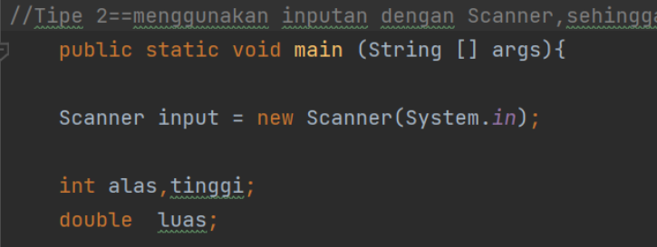
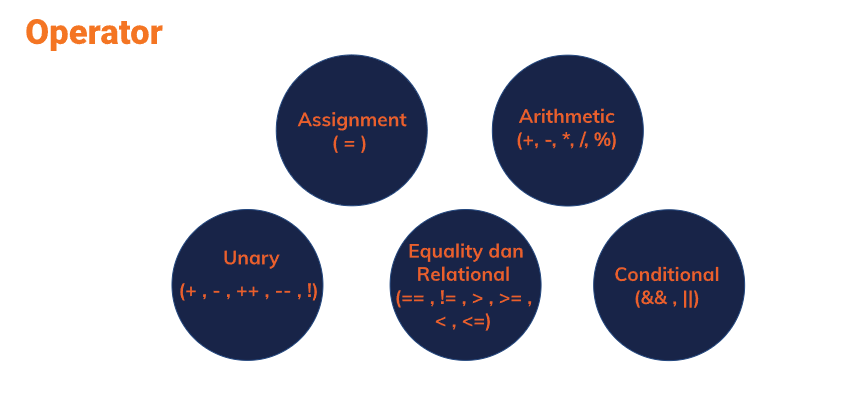
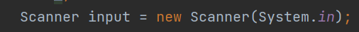

# Nama : Gladys Cindana Pardosi
# Kelas : QE_B

## SUMMARY

## POIN1
* Alasan Penggunaan Bahasa Progaram Java
1. Java memiliki struktur/sytax  yang sederhana dibandingkan bahasa pemrograman lain

2. Hanya berfokus pada objek,sehingga program komputer dapat saling berinteraksi dengan mudah hanya dengan 1 objek

3. Terdapat 3 lapis pengamanan pada Java sebagai pelindung sistem dari orang-orang yang tidak berkepentingan

4. Merupakan bahasa pemrograman yang tidak terikat ke OS apapun

5. Menggunakan sistem Exception Handling, dimana dapat memisahkan antara  pengamanan kode kesalahan dan kode normal,sehingga kode program dapat diarahkan ke kode program yang lebih bersih,karena jika menemukan kesalahan java akan langsung menemukan Exception dan exception dapat dikelola program tanpa memberikan dampak yang lebih buruk

6. Mendukung Native Method ,dimana native method artinya sebuah fungsi yang ditulis di bahasa lain seperti C dan C++. Dengan adanya native method, memungkinkan programmer menulis fungsi yang bisa dilakukan lebih cepat dibanding yang lain

7. Garbage Collector yang berfungsi untuk mengumpulkan sampah secara otomatis, adanya garbage collector ini programmer tidak perlu dibebani dengan adanya memori yang rusak 

8. Library yang lengkap

9.  Terdapat Fitur GUI

10. Mirip dengan C++

TOOLS untuk java adalah :
* JDK
* IDE == netbeans,eclipse,intelij,BluJ

## POIN 2

===TIPE DATA PADA JAVA PROGRAMMING LANGUAGE===

1. Integer == angka atau bilangan bulat
2. char: Tipe data karakter 
3. float: bilangan desimal kapasitasnya lebih kecil
4. double: bilangan desimal juga, kapasitasnya lebih besar
6. String: kumpulan dari karakter yang membentuk teks
7. boolean: tipe data yang hanya bernilai true dan false

#### Cara pendeklarasian variabel :

tipe_data nama_variable;

==contoh : int angka1; 

#### Cara pendeklarasian Variabel dengan menginisialisasi value nya 

tipe_data nama_variable = value;

==contoh : int angka1=19;

contoh Code :

## Poin 3

Array == merupakan satu variabel yang menampung banyak data atau angka atau karakter.Penggunaan array terdapat 3 cara yaitu :

* String [] kelas;
* String kelas [];
* String [] kelas = new String[5];

 Pada array, untuk setiap data yang didalamnya terdapat penanda yang disebut sebagai Indeks dimana penghitungan untuk Indeks dimulai dari 0,namun untuk jumlah/kapasistas array tetap dihitung dari 1. Contoh :

String [] kelas = {"a","b","c"} 

==> indeks a=0,b=1,dan c=2
==> Kapasitas array 3

Ketika ingin melakukan pencetakan pada array,maka akan menjadi :

## System.out.println("Indeks array 1 adalah " [1]);
## hasilnya = b

## Poin 3_2 
## Operator,Input Output,branching, Looping

* Operator merupakan tanda operasi pada matematika seperti:
1. perkalian = *
2. penjumlahan = +
3. Pengurangan = -
4. ...

* Input Output
== Input : masukan terhadap sistem,misal kita ingin memasukkan angka untuk dikalkulasi pad aprogram kita.

Maka kita harus membuat program untuk user agar bisa menginput angka ke dalam code.

==Output : merupakan keluaran/hasil dari input yang kita berikan

* Branching merupakan percabangan, dimana pada java terdapat 3 percabangan :
1. If
2. if Then
3. Switch Case

* Looping :
1. For
2. While
3. Do While