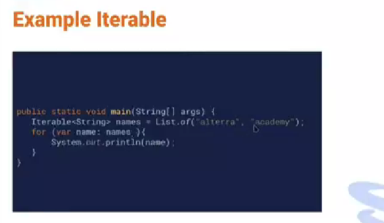
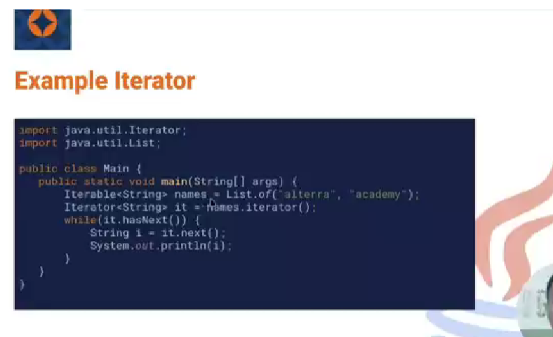
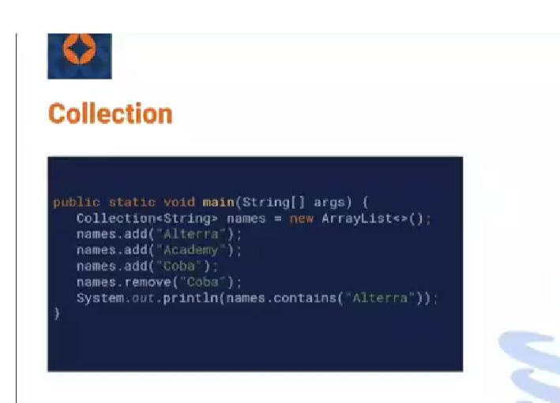
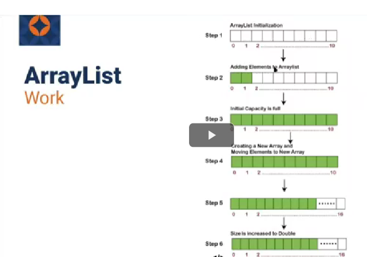
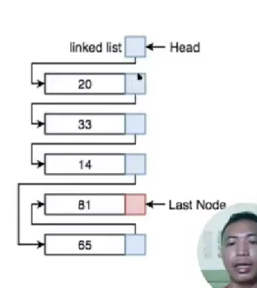
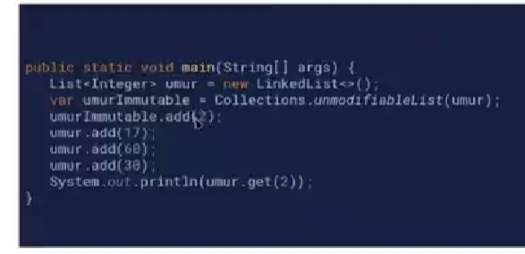
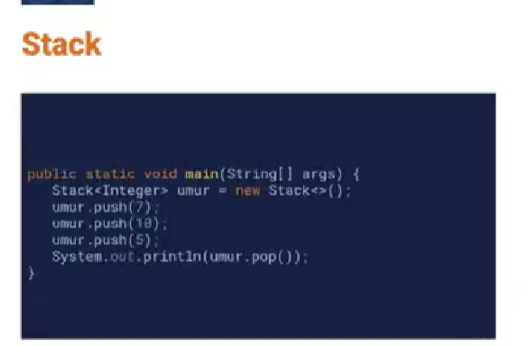

# Gladys Cindana Pardosi
# Kelas_B_QE

### Iterable

==> sebuah iterable adalah objek yang memiliki iterator. Contoh iterable adalah array dan set. Iterator adalah properti dari objek yang menyediakan mekanisme untuk melintasi objek.Pada Gambar iterable diatas terjadi ketika dilakukan sebuah perulangan for yang membentuk variabel baru yaitu name untuk menyimpan variabel names lalu mencetak variabel name tersebut sehingga akan menghasilkan alterra untuk hasil pertama dan hasil kedua adalah academy.

### Iterator

==> Iterator adalah objek yang padanya bisa dilakukan iterasi. Pada Iterator diatas, terdapat sebuah iterator yanag membentuk iterator bernama it dari iterable.Lalu dibentuk perulangan while yang memiliki method has.next dimana memeriksa apakah iterator memiliki data berikutnya. Jadi ketika pertama kali akan dihasilkan true karena di variabel names terdapat data alterra. Lalu akan di cek apakah memiliki data selanjutnya, dna ternyata ada data academy,maka akan dicetak sampai perulangan tersebut bernilai false.

### Collection

Collection adalah suatu objek yang bisa digunakan untuk menyimpan sekumpulan objek. Collection merupakan turunan dari iterable. Pada gambar diatas,digunakan Collection yang bertipe Arraylist, untuk melakukan penambahan data dapat digunakan method add dan menghapus data dapat digunakan remove.

### List

interface yang menyediakan penyimpanan data secara linear,List merupakan nterface dari collection,list dapat menerima data duplikat, urutan data pada list dimulai dari data pertama yang dimasukkan.

Implementasi dari Interface List :

* Arraylist ==> menyimpan data secara dinamis(tidak terikat dengan kapasitas) selama komputer masih memiliki memori untuk menyimpan data.  Pada gambar diatas , step 1 menunjukkan bahwa Arraylist diinisialisasi terlebih dulu,lalu langkah selanjutnya akan ditambahkan elemen ke dalamnya, ketika elemen tersebut full/penuh, maka akan secara otomatis membentuk sebuah array baru dan memindahkan elemen-elemen tersebut ke Array baru yang lebih besar kapaditasnya.

* Linkedlist ==> Penyimpanan sebuah data yang elemen-elemennya saling terhubung satu sama lain dengan menyimpan alamat memori dari elemen sebelumnya. 

* ImmutableList ==> merupakan penyimpanan data yang tidak dapat di modifikasi 

* Stack ==> merupakan penyimpanan data yang menggunakan konsep LIFO(last in first out), yang terakhir dimasukkan menjadi yang pertama di keluarkan. Terdapat method pop dan push untuk penggunaan stack,dimana pop untuk mengambil dan push untuk menambah. Peek digunakan untuk melihatt size dari stack tersebut 

* Set ==> penyimpanan sebuah data secara linear yang  dapat menerima data duplikat namun hanya akan dituliskan sekali saja dari data duplikat tersebut .

===ARRAYLIST VS LINKEDLIST====

1. Ketika Ingin mengakses sebuah element,arrayllist lebih cepat dibandingkan linkedlist karena Linked memiliki konsep pengaksesan satu per satu dengan melihat alamat memori yang saling terhubung

2. Ketika ingin melakukan insert/remove dari urutan pawal,linkedlist lebih cepat dibandingkan array list karena linkedlist mengakses elemen sesuai dengan urutan alamat elemen sebelumnya. 

3. Ketika mengakses dari urutan terakhir maupun urutan tengah,maka Array List dan linked list sama sama menghabiskan waktu yang banyak.