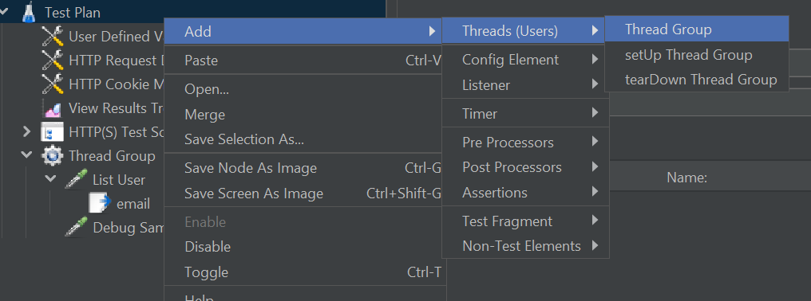
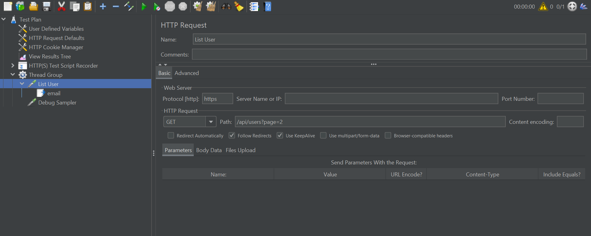
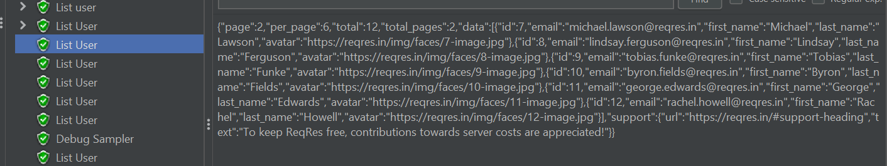
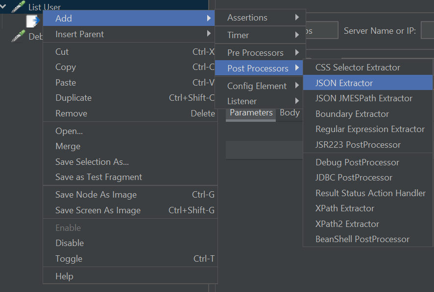
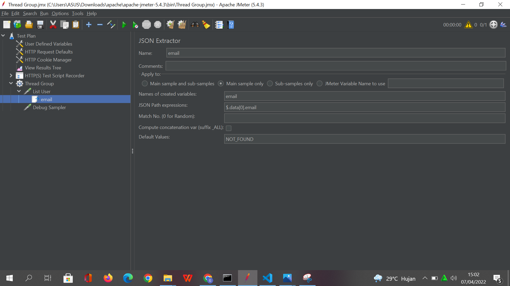
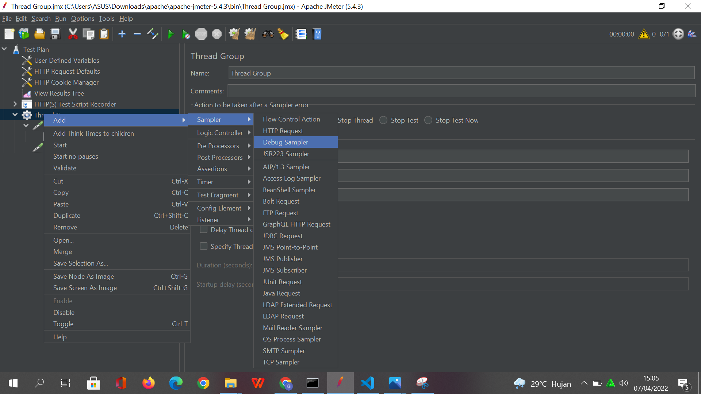
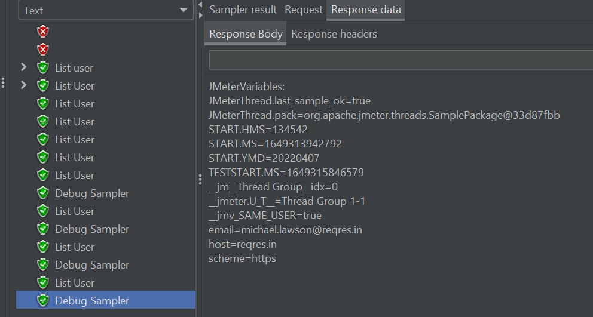
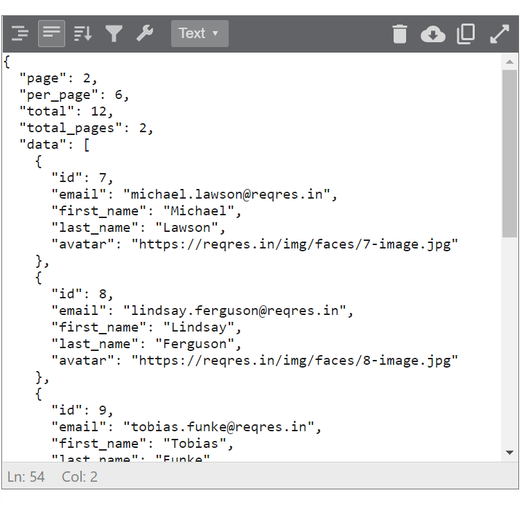
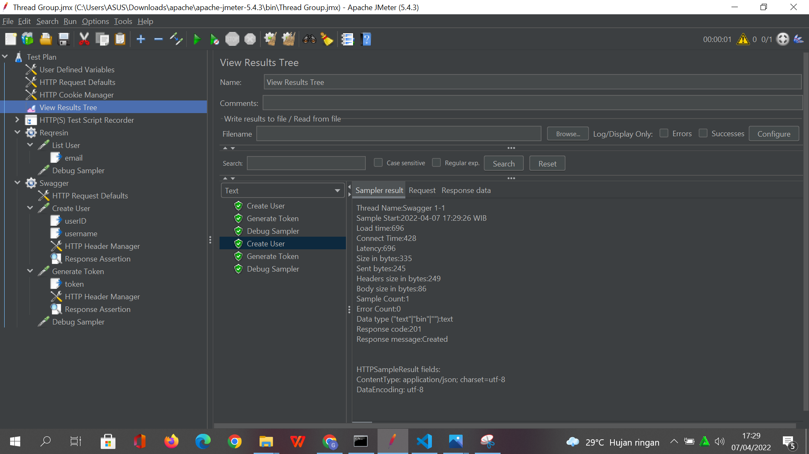

# Nama : Gladys Cindana Pardosi
# Kelas : B_QE

**Post Processor**
==> Merupakan aksi yang berjalan ketika proses setelah dilakukan,proses request ke suatu alamat web. Pada umumnya, mengekstrak
value yang didapatkan dari hasil mengakases halaman sebuah web. Post processor yang bisa digunakan di JMeter adalah **Json Extractor**

**JSON Extractor**
Pada JSon Extractor kita dapat menggunakan Json Path untuk mengambil nilai yang terdapat dari data json yang dihasilkan dari respons saat kita melakukan request. 

**JSON Path**

1. Digunakan Untuk extract isi dari JSON Response
2. Beberapa ekspresi yang umum digunakan :
 * $ = Root Element
 * . = Child Operator
 * []= child operator array
 * .. = recursive descent(langsung ke objek)
 * * =wildcard(all things)
 *[ start:end ] = array slice operator borrowed 

## EXERCISE

1. Buat terlebih dahulu sebuah Thread Group 

2. Di dalam Thread Group tersebut akan terdapat sebuah HTTPRequest,kita dapat rename namanya menjadi List User

3. Di dalam List user, set protocol yang digunakan adalah HTTPS, Method yang digunakan adalah get, dan menambahkan pathnya sesuai dengan yang ingin di tes.

4. Setelah itu dapat kita run, dan hasilnya akan menunjukkan :

5. Untuk penggunaan post processor,dapat kita lihat ketika kita ingin mengambil suatu nilai dari pengaksesan sebuah halaman web. Dimana post processor yang biasa kita gunakan dalam performance test adalah JSON Extractor. Untuk pembuatan JSON Extractor dapat dilihat pada gambar berikut ini :

6. JSON Extractor berfungsi untuk mengekstrak nilai yang kita dapat dari response sebelumnya,disini kita akan mengambil value email dari array yang ke-0,maka akan seperti berikut ini : 

JSon Path expressionnya menunjukkan bahwa kita akan mengambil value email dari array ke 0 dan untuk menjalankannya  dan menampilkan hasilnya kita harus menambahkan debug sampler terlebih dahulu

7. Tambahkan debug sampler,dan tidak perlu mengubah apapun pada debug samplernya.

8. Lalu kita jalankan, dan ketika dilihat result nya di view result tree maka akan menjalankan request list user beserta debug samplernya.

dimana jika kita validasi kebenarannya,berikut ini adalah data array ke 0 yang menjadi response dari request yang kita buat.

## EXERCISE SWAGGER

### Debug Debug Sampler Swagger
skenario yang ada adalah :

1. Create Akun menggunakan method post dan memasukkan HTTP header Manager nya

2. Create JSON Extractornya untuk mendapatkan variable User ID dan UserName untuk generate token 

3. Lalu create HTTP Request dan rename menjadi Generate Token

4. Lalu masukkan body pada generate token sesuai dengan userID yang ada di JSON Extractor Create Akun sebelumnya

5. Tambahkan HTTP Header nya karena kita menggunakan method Post

6. Kita juga dapat menambahkan Assertion berupa respon status code dari request yang dibuat di dalam setiap HTTP Request.

Maka Hasil debug samplernya adalah : 

