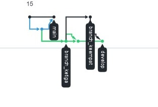

# Nama : Gladys Pardosi
# Kelas : QE_B

## "Resume"

### Poin 1 : Versioning 

* Versioning merupakan sebuah sistem yang merecord perubahan perubahan sebuah berkas/dokumen dari
waktu ke waktu sehingga kiita bisa melihat dokumen dari setiap versinya. Salah satu version control yang sedang populer adalah Git.

### Poin 2 : Git

* Git merupakan salah satu version control yang sangat populer di kalangan software development
* Staging area dari Git adalah 
**Working Directory** -->  **Staging area** --> **Git Repository**

* Perintah perintah pada git 

    1. Git status == untuk menampilkan daftar file yang update,file ditambah,dan commit
    2. Git config == perintah git untuk mengatur       konfigurasi dari format file,username,diff,email dsb. contoh : dalam penggunaan email untuk login ke github melalui git. 
    **contoh** : git config --global user.email gladyscaprds@gmail.com
    3. Git Init == perintah init digunakan untuk membuat repositori baru
    **contoh** : git init
    4. Git add == perintah untuk menambahkan file ke ropository yang kita inginkan 
    **contoh** : git add index.php
    5. Git clone == merupakan perintah yang digunakan untuk melakukan salinan ke repo lokal
    **contoh** : git clone /path/to/repository
    6. Git Commit == digunakan untuk menyimpan perubahan yang sudah dilakukan, namun tidak ada perubahan yang terjadi pada remote repository
    **contoh** : git commit –m “first commit”
    7. Git push ==perintah push akan mengirimkan perubahan ke master branch dari remote repository yang berhubungan dengan directory.
    **contoh**  : git push origin master
    8. Git Checkout == Perintah git checkout bisa digunakan untuk membuat branch atau untuk berpindah diantaranya
    **contoh** : command git checkout -b <nama-branch>
    9. Git remote ==  Perintah git remote akan membuat user terhubung ke remote repository.
    **contoh** : git remote -v
    10. Git pull ==  perintah untuk menggabungkan semua perubahan yang ada di remote repository ke local directory.Perintah git pull digunakan saat kita tidak pernah melakukan commit apapun di repo lokal
    **contoh** : git pull origin master 

    11. Git fetch == perintah untuk menggabungkan semua perubahan yang ada di remote repository ke local directory.Perintah git fetch digunakan saat kita sudah pernah melakukan commit di repo lokal.
    **contoh** : git fetch origin master

## note : 
* Pull request adalah suatu permintaan untuk menggabungkan (merge) kode yang kita modifikasi dengan repositori utama atau repositori lain.

### Poin 3 : Bagaimana mengoptimalkan sebuah kolaborasi dalam software development??

Untuk membuat proses development optimal maka perlu dibuat beberapa branch dengan cara :
1. Buat branch Master dari branch development
2. Hindari direct edit ke branch development 
3. Merge branch feature hanya ke branch development 
4. Merge branch development ke branch master jika debelopment selesai

## " TASK "

Pada task ini, saya membuat sebuah repository yang baru di github dan memasukkan sebuah file ,lalu membentuk 3 branch yaitu develop,branch_ketiga, dan branch_keempat sehingga total branch pada repository saya ada 4(termasuk branch default/ main saat membuat repository baru). Saya melakukan perubahan pada branch ketiga dan branch keempat, lalu melakukan merge branch ketiga ke branch develop dan merge branch keempat ke branch develop. Sehingga semua perubahan yang terjadi pada branch ketiga dan keempat telah masuk ke dalam branch develop bukan ke branch master. Berikut ini bentuk network dari repository yang telah saya buat :

