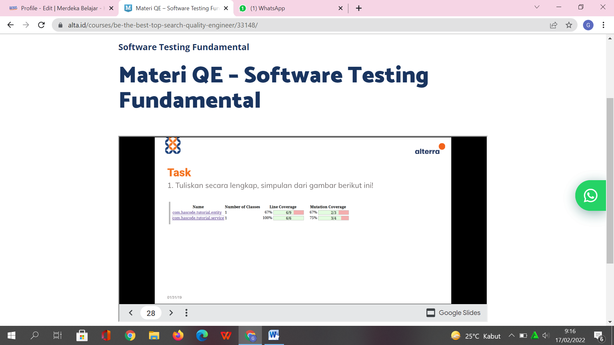
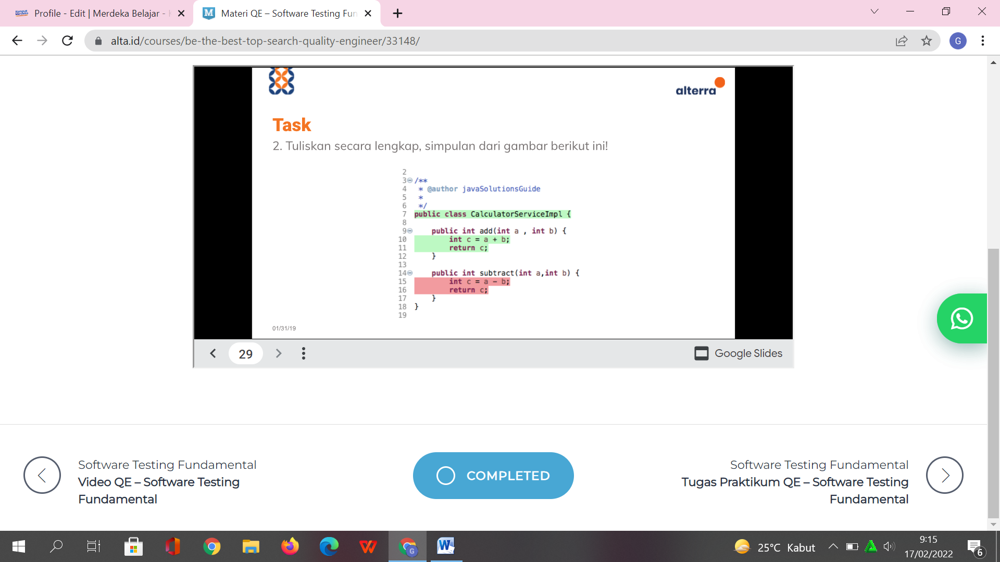

## Nama : Gladys Cindana Pardosi
## Kelas : QE_B 

## TASK 1 : 

Task diatas menunjukkan sebuah Unit testing dan terdapat 2 test case yang dimana Line coverage nya bernilai 67 % dan 100%,pada line coverage akan ditunjukkan jumlah baris code yang sudah diuji.  Line coverage merupakan bagian dari code coverage yang merupakan standar kualitas dari sebuah software. Ketika code coveragenya rendah maka akan dibutuhkan biaya maintenance yang tinggi karena menunjukkan bahwa masih banyak baris code yang masih belum dilakukan pengujian sehingga kemungkinan masih terdapat bug yang belum diperbaiki oleh developer.
Sebuah program memiliki kualitas yang baik apabila mutation score yang terdapat pada program tersebut bernilai 100%. Pada test case diatas mutation coverage nya masih belum bernilai 100 % sehingga perlu dilakukan penambahan test case untuk setiap program diatas sehingga saat ingin mendapatkan mutation score 100% maka test case yang  dijalankan harus mendapatkan nilai yang berbeda dengan expected outputnya, maka mutant tersebut dapat ter-kill dan menambah score mutationnya.

## TASK 2 :

Task diatas menunjukkan sebuah Unit testing dan terdapat 2 test case yang dimana Line coverage nya bernilai 67 % dan 100%,pada line coverage akan ditunjukkan jumlah baris code yang sudah diuji.  Line coverage merupakan bagian dari code coverage yang merupakan standar kualitas dari sebuah software. Ketika code coveragenya rendah maka akan dibutuhkan biaya maintenance yang tinggi karena menunjukkan bahwa masih banyak baris code yang masih belum dilakukan pengujian sehingga kemungkinan masih terdapat bug yang belum diperbaiki oleh developer.
Sebuah program memiliki kualitas yang baik apabila mutation score yang terdapat pada program tersebut bernilai 100%. Pada test case diatas mutation coverage nya masih belum bernilai 100 % sehingga perlu dilakukan penambahan test case untuk setiap program diatas sehingga saat ingin mendapatkan mutation score 100% maka test case yang  dijalankan harus mendapatkan nilai yang berbeda dengan expected outputnya, maka mutant tersebut dapat ter-kill dan menambah score mutationnya.

