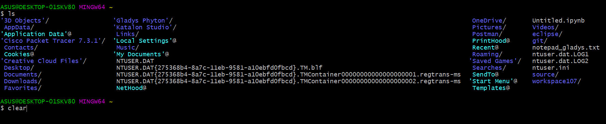
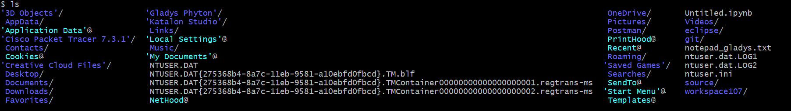

# NAMA : GLADYS CINDANA PARDOSI
# KELAS: QE_B

## SECTION 09 : BASIC COMMANDS LINUX
### SUMMARY & TASK

* Cal == merupakan perintah linux untuk menampilkan kalender. Berikut ini tampilannya:

Tetapi pada Gitbash perintah ini tidak terdeteksi

* Date == Merupakan perintah linux untuk menampilkan waktu/jam pada saat dilakukan eksekusi tersebut

## File System Command 

* Touch == merupakan Perintah yang bisa digunakan untuk membuat file baru dengan berbagai jenis format

* Cat == merupakan perintah yang digunakan untuk melihat isi dari suatu file,dimana dibawah ini terdapat file notepad_gladys.txt yang berisi "halo gladys!"

* Cp commands == merupakan perintah yang digunakan untuk melakukan duplikasi terhadap suatu file yang diinginkan dengan format "cp file_kamu"

* mv commands == merupakan perintah di linux untuk melakukan moving/pemindahan menuju directory lain.

* rm == merupakan perintah linux yang berasal dari kata remove yang artinya perintah ini digunakan untuk menghapus.

* mkdir == merupakan perintah untuk membuat sebuah folder baru pada directory 

* cd command == merupakan command yang digunakan untuk masuk atau keluar ke directory yang diinginkan. ketika masuk, maka formatnya akan menjadi "cd directori_tujuan",namun jika keluar hanya menggunakan command cd saja.

* pwd command == merupakan perintah yang digunakan untuk melihat directory sekarang

## -----Process Control Commands----

* Top == merupakan command yang digunakan untuk memperlihatkan layar penuh informasi tentang proses yang berjalan pada sistem, serta beberapa informasi keseluruhan tentang system. Pada gitbash,command ini tidak terdeteksi.

 Berikut tampilan pada linux :

* Clear == digunakan untuk menghapus isi terminal

* History == digunakan untuk menampilkan riwayat penggunaan giitbash-nya.

## UTILITIES PROGRAM COMMANDS 

* LS == command yang digunakan untuk melihat folder-folder maupun file-file yang terdapat dalam directory sekarang.

* Which == merupakan perintah yang digunakan untuk menemukan path secara lengkap

* Sudo == merupakan command yang sering digunakan pada linux untuk masuk ke suatu hak akses,namun pada gitbash tidak terdapat command ini.

*Find == merupakan command yang digunakan untuk mencari suatu file

## FILE ACCESS PERMISSION

* chmod == Pada File Access permission terdapat perintah chmod yang berfungsi untuk mengganti izin akses terhadap suatu file atau directory. terdapat 3 angka yang menjadi kode di dalamnya ::

4 :r ==read

2 :w ==write

1 :x ==execute

urutan penggunaan :

user-group-other, sehingga apabila kondisinya  user dapat melakukan read-write-execute, group hanya read-write, dan other hanya read, maka kode yang tercipta untuk pengaturan hak akses ini adalah chmod 764 dimana :

7=4+2+1

6=4+2+0

4=4+0+0

Namun pada Gitbash tidak dapat melakukan pergantian hak akses, berikut ini gambarnya :

* chown == menetapkan hak akses 

## SHELL SCRIPT

* Program 1 :

Pembuatan File dan mengisi File ,sehingga ketika diexecute akan tampil 

hasilnya :

* Program 2 :

*read* digunakan untuk memberikan Inputan pada program yang diberikan

Hasilnya :

* Program 3 :

Penggunaan parameter dolar ($)

Hasilnya :

* Program 4 : 

Program dibawah ini merupakan penggunaan operasi pada shellscript dengan fungsi Let.

Hasilnya :

* Program 5 :

Deklarasi dan pencetakan variabel menggunakan fungsi Echo

