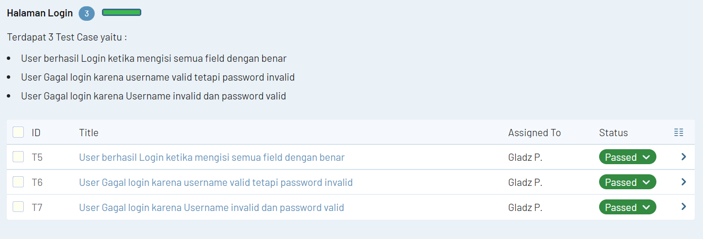
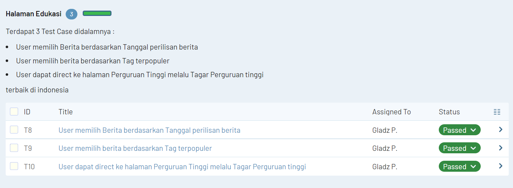

## Nama : Gladys C A Pardosi
## Kelas : B_QE

# PORTAL BERITA DETIK.COM

Pada Pengujian kali ini dilakukan terhadap Portal Berita Online yaitu Detik.com. Terdapat 3 Halaman yang diuji yaitu Registrasi, Login dan halaman Edukasi. Masing-masing Halaman akan dibatasi minimal 3 Test Case dan akan dimasukkan ke dalam Test Case Management Tools yaitu Test Rail. Terdapat 10 Test Case yang diuji dengan persentase status passed sebesar 100% karena memang belum ada bug yang ditemukan dari test case yang diambil. Berikut ini gambaran dari Test Run Portal Berita Online Detik.com:

Milestone merupakan sebuah tolak ukur waktu yang harus tepati oleh tim mengenai jangka waktu yang digunakan untuk membangun fitur-fitur yang akan dikerjakan. Pada Pengujian kali ini diberikan Milestone01 yang memiliki jangka waktu selama 1 Minggu,Berikut Ini merupakan milestone dari Detik.com yang sudah di-complete-kan karena telah selesai :

* **Halaman Registrasi**

* **Halaman Login**

* **Halaman Edukasi**

# ------------ TEST CASE -----------------

*Registrasi*

* User berhasil Registrasi dengan mengisi semua Field Registrasi sesuai Requirement

* User Gagal Registrasi dengan password yang kurang dari 8 Karakter dan Bukan merupakan kombinasi huruf-angka

* User Gagal Registrasi dengan nomor telepon yang telah terdaftar sebelumnya

* User Gagal Registrasi ketika menginput nomor telepon >14 karakter

-----------------------------------------------------------------

*Login*

* User berhasil Login ketika mengisi semua field dengan benar

* User Gagal login karena username valid tetapi password invalid

* User Gagal login karena Username invalid dan password valid

-----------------------------------------------------------------

*Edukasi*

* User memilih Berita berdasarkan Tanggal perilisan berita

* User memilih berita berdasarkan Tag terpopuler

* User dapat direct ke halaman Perguruan Tinggi melalu Tagar Perguruan tinggi

# E-COMMERCE Bhineka.com

Selain Portal Berita Online dilakukan juga Pengujian terhadap E-commerce Bhineka.com. Terdapat 3 Halaman Pengujian dengan masing-masing sebanyak 3 Test Case. Terdapat 9 Test Case yang diuji, namun salah satunya terdapat Bug yang diindikasikan oleh berhasilnya user mengirimkan chat dengan nomor telepon yang salah dimana tidak ada pembatasan untuk digit/karakter nomor telepon. Sehingga Persentase uji website ini sebesar 89% dari 9 Test case, Berikut ini Test Run nya :

**Milestone**

## Test Case :

*Riwayat Belanja*

* User mencari barang dengan menggunakan filter list barang pada riwayat belanja

* User melakukan pembelian ulang dengan menambahkan produk ke keranjang

* User direct ke halaman home ketika tidak ada produk di riwayat belanja

---------------------------------------------------------------------------

*Keranjang*

* Ubah Alamat

* melihat Total Pembayaran

* Hapus Semua Barang di keranjang

---------------------------------------------------------------------------

*Chat*

* User Chat CS Bhineka Pembelian Personal dengan mengisi field nomor telepon dengan karakter  lebih dari 14

* User mengakses Chat CS Bhineka Pembelian Korporat tanpa login

* Chat CS Bhineka Customer Service tanpa mengisi field 'apa yang bisa kami bantu?'\

