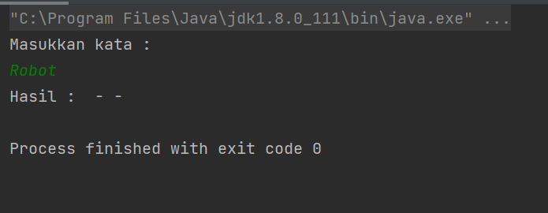
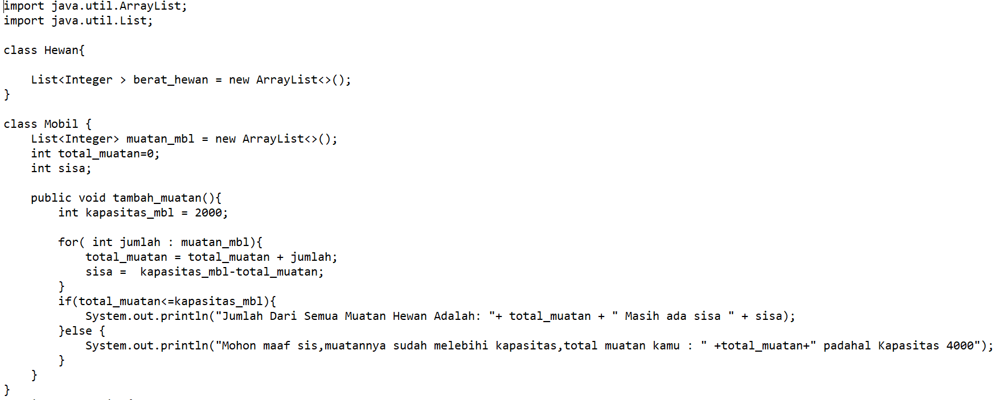

## Nama : Gladys Cindana Pardosi
## Kelas : B_QE

# Program01

==> Pada Program pertama diberikan 2 Lopingan for untuk pembentukan formasi jam pasir bagian atas. Pada for pertama diset jumlah_baris adalah 1jumlah baris harus kurang atau sama dengan inputan yang telah diberikan user,lalu akan di cetak sebuah spasi. Ketika di for kedua, akan diset jumlah_bintang = inputan user yang sebelumnya (ex :5) dan jumlah_bintang harus lebih besar dari jumlah baris lalu akan dilakukan pencetakan bintang lalu dilakukan decrement sehingga nantinya akan terus terjadi perulangan yang membentuk jam pasir bagian atas.

==> Pada Loopingan kedua ini sama halnya dengan loopingan pertama,namun perbedaan yang terjadi adalah karena akan membentuk jam pasir,maka loopingan kedua harus dimulai dari jumlah_kolom = inputan user dan jumlah bintang= 1.

# Program02

==> Pada Program kedua diberikan syarat bahwa ketika terdapat huruf vokal pada sebuah kata akan diberikan :

* a= .
* i= .
* o= -
* u= .
* huruf selain itu akan menjadi spasi

sehingga diberikan sebuah function gantikarakter yang berparameterkan variabel inputanString. inputanString merupakan inputan yang dimasukkan user, function gantukarakter menerapkan kondisi yaitu switch case seperti pada gambar berikut ini :

Sehingga hasil dari Program ini adalah :

# Program03

==> Pada program 3 ini terdapat 3 class dimana ada class mobil dan class hewan yang memiliki properti masing masing,serta satu lagi merupakan class main untuk menjalankan fungsi2 yang terdpaat pada class hewan dan mobil. Pada class hewan terdapat properti yang hanya menyimpan data berat badan hewan sedangkan class mobil memiliki 4 atribut 1 method. Atributnya adalah : muatan_mbl,total_muatan,sisa,dan kapasitas_mbl

* muatan_mbl== menyimpan data muatan yang ada sekarang
* kapasitas_mbl== menyimpan kapasitas yang dapat ditampung mobil
* jumlah == merupakan variabel pengganti muatan_mbl sehingga muatan_mbl = jumlah
* total_muatan== menyimpan hasil penjumlahan muatan sekarang dengan muatan yang akan ditambahkan,total_muatan diset 0 untuk pertama kalinya karena dianggap kosong.

Method void tambah_muatan berfungsi untuk melakukan perhitungan total_muatan mobil, pada program ini di set kapasitas_mbl adalah 2000,sehingga ketika total_muatan lebih kecil sama dengan dari kapasitas mobil,maka akan dicetak jumlah Dari Semua Muatan Hewan serta sisanya. Nmaun ketika sudah melewati kapasitas,akan dicetak bahwa muatan telah melebihi kapasitas.

Maka hasil dari Code progrm ini adalah :

# Program04

Code program berfungsi untuk mencari index dari sebuah huruf yang diinput. misalnya : 

Pada code program keempat ini akan terdapat perulangan dengan varaiabel x,w,y,,z sebagai parameternya dimana untuk perulangan for pertama berfungsi untuk menghitung baris dan perulangan for kedua untuk kolom. Setelah dilakukan perulangan,akan diberikan kondisi ketika variabel str sesuai dengan posisi baris dan kolom inputan tersebut maka kolom dan baris akan bergeser 1 langkah lalu mencetak Output Index variabel  tersebut. Apabila inputannya adalah K,maka indeksnya akan sama dengan C.

